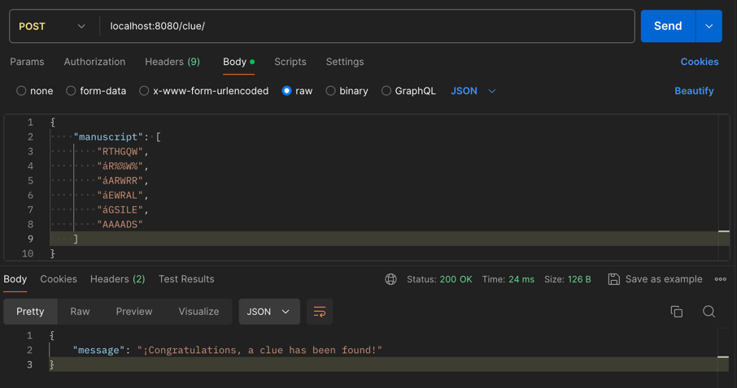
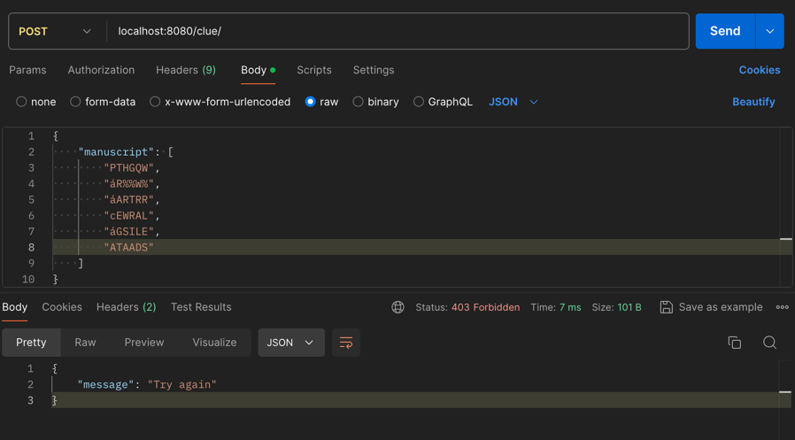
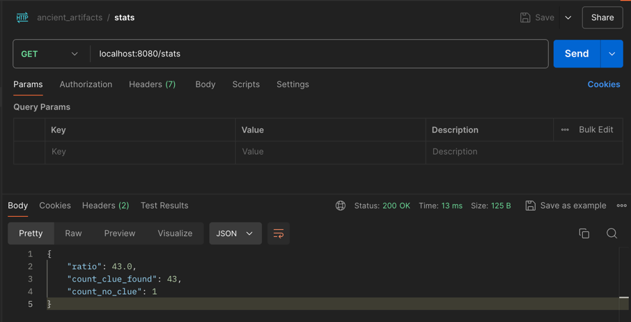

# Artefactos Antiguos (ms_ancient_artifacts)

El microservicio fue nombrado ms_ancient_artifacts, debido a que el sabio anciano Elowen, requiere rastrear y
asegurar artefactos antiguos que otorgan habilidades mágicas a sus portadores antes de que caigan en manos equivocadas,
dentro de este contexto de ARTEFACTOS ANTIGUOS, se podrán analizar deferentes pistas ya sean manuscritos, imágenes,
hechizos, encantos (con sus próximas evoluciones) con el fin de poder encontrar dichos artefactos.

## Antes de Iniciar

El microservicio esta realizado [Clean Architecture](https://medium.com/bancolombia-tech/clean-architecture-aislando-los-detalles-4f9530f35d7a) con el fin de tener una fácil comprensión del código,
facilitar el reúso de ciertos componentes, separar responsabilidades, proteger la lógica de negocio,  entre otras
ventajas que ofrece esta arquitectura de software.


## Algoritmo Búsqueda de Pistas

### Criterio de Identificación
Un manuscrito contiene una pista sobre la ubicación de un artefacto si se encuentran secuencias de cuatro
letras consecutivas en cualquier dirección (horizontal, vertical o diagonal)

```````
String[] manuscript = {"RTHGQW", "XRLORE", "NARURR", "REVRAL", “EGSILE", "BRINDS"};
```````

Se implementó un algoritmo que recorra la matriz sin importar su tamaño, iniciando en la posición (0,0) 
y validando las 4 siguientes letras (hacia su derecha, abajo, diagonal derecha, diagonal izquierda)

```````
[R][T][H][G][Q][W]
[X][R][L][O][R][E]
[N][A][R][U][R][R]
[R][E][V][R][A][L]
[E][G][S][I][L][E]
[B][R][I][N][D][S]
```````

## Endpoints Implementados

Este microservicio está desplegado dentro EC2 de AWS, con el fin de que el sabio Elowen y sus ayudantes, puedan 
acceder desde cualquier lugar del mundo mediaval fantástico.

### Analisis de Pistas 
[POST → /clue/] El endpoint se encarga de recibir en formato JSON el manuscrito, En caso de que se encuentre una pista 
sobre el artefacto, se retorna un HTTP 200-OK; en caso contrario, un 403-Forbidden.

#### Puede hacer uso del siguiente CURL, desde cualquier lugar del mundo fantástico
curl --location 'http://18.116.85.211/clue/' \
--header 'Content-Type: application/json' \
--data '{"manuscript": ["RTHGQW","áR%%W%","áARWRR","áEWRAL","áGSILE","AAAADS"]}'

#### Clonando el Repositorio
1. Podría clonar este repositorio
2. Abrir en un IDE como IntelliJ el repositorio descargado
3. Ejecutar el archivo MainApplication.java para ejecutar el microservicio
4. Usar el siguiente CURL en su postman para lanzar peticiones a su ambiente local

curl --location 'localhost:8080/clue/' \
--header 'Content-Type: application/json' \
--data '{"manuscript": ["RTHGQW","áR%%W%","áARWRR","áEWRAL","áGSILE","AAAADS"]}'

### Ejemplo pista encontrada



### Ejemplo pista NO encontrada



### Estadisticas de Pistas
[GET → /stats] El endpoint se encarga de mostrar el conteo de los manuscritos que contienen pistas y el conteo de 
los manuscritos que no contienen pistas


#### Puede hacer uso del siguiente CURL, desde cualquier lugar del mundo fantastico
curl --location 'http://18.116.85.211/stats'

#### Clonando el Repositorio
1. Podría clonar este repositorio
2. Abrir en un IDE como IntelliJ el repositorio descargado
3. Ejecutar el archivo MainApplication.java para ejecutar el microservicio
4. Usar el siguiente  CURL en su postman para lanzar peticiones a su ambiente local
   
curl --location 'localhost:8080/stats'


### Ejemplo consulta
